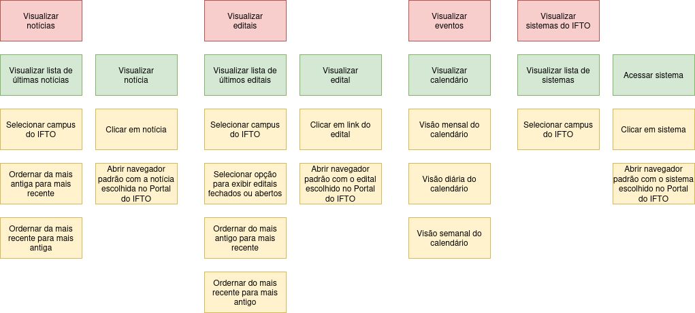

# IFTONews

O projeto tem como objetivo principal simplificar e otimizar o acesso às informações do Portal do IFTO (como notícias, editais, eventos, etc) em dispositivos móveis consumindo o mínimo possível de banda larga.

### Problemática
Atualmente, um dos meios para acompanhar as notícias, editais e eventos do IFTO é acessando o portal oficial do Instituto Federal na Internet. Porém, além das notícias, outros recursos são apresentados sem a opção de escolha, impedindo o carregamento rápido da página em dispositivos móveis, e aumentando também o consumo de banda larga.

### Solução
O projeto visa resolver o problema de carregamento lento e consumo excessivo de banda larga que os estudantes e servidores enfrentam ao tentar se manterem informados sobre o que acontece no âmbito do Instituto Federal de Educação, Ciência e Tecnologia do Tocantins.- 

## Story Map

## Stack utilizada

**Mobile:** Java

## Autor

- [@luanluz](https://www.github.com/luanluz)

## Licença

[MIT](https://choosealicense.com/licenses/mit/)

